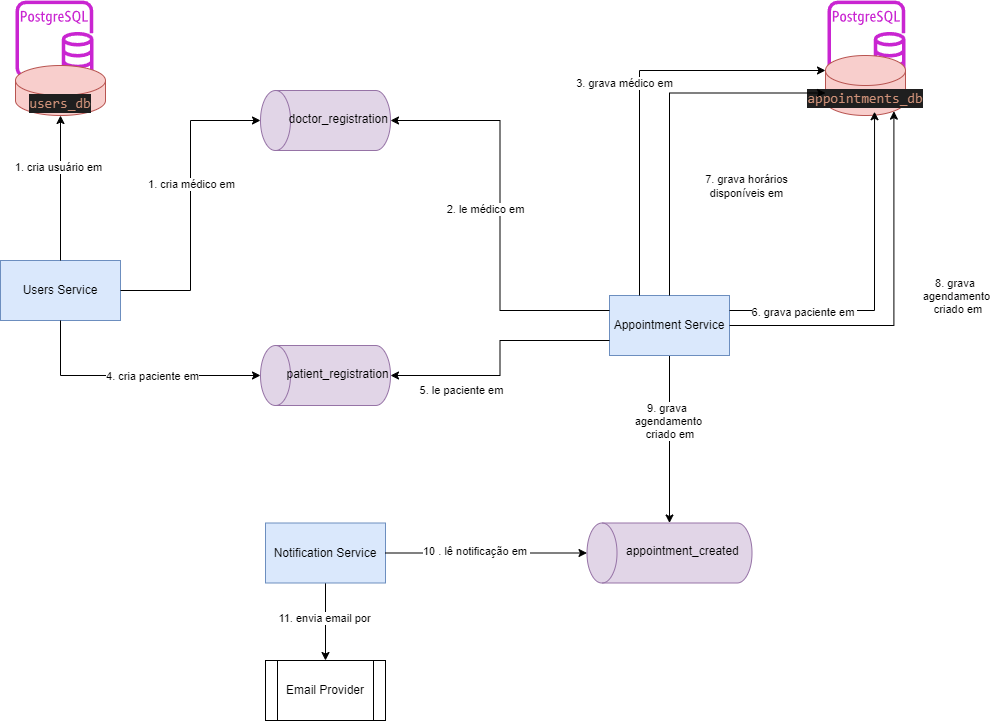

# Sistema de Agendamento Médico com Notificação por E-mail

Este projeto consiste em três microsserviços que juntos formam um sistema de cadastro de usuários, agendamento de horários médicos e envio de notificações por e-mail. A comunicação entre os microsserviços é feita via RabbitMQ, e a execução local é gerenciada com Docker e Docker Compose.

## Sumário

1. [Microsserviços](#microsserviços)
   - [Users Service](#users-service)
   - [Appointments Service](#appointments-service)
   - [Notification Service](#notification-service)
2. [Tecnologias Utilizadas](#tecnologias-utilizadas)
3. [Pré-requisitos](#pré-requisitos)
4. [Desenho da Arquitetura](#desenho-da-arquitetura)
5. [Instruções de Instalação](#instruções-de-instalação)
6. [Execução do Sistema](#execução-do-sistema)

## Microsserviços

### Users Service

- **Descrição**: Responsável pelo cadastro e autenticação de usuários (médicos e pacientes).
- **Tecnologias**: Node.js, TypeScript, PostgreSQL, TypeORM, RabbitMQ.
- **Principais Funcionalidades**:
  - Cadastro de usuários (médicos e pacientes)
  - Login de usuários
  - Publicação de eventos de criação de médicos e pacientes no RabbitMQ para o serviço Appointment Service

### Appointments Service

- **Descrição**: Gerencia os horários médicos e permite que os pacientes façam reservas para consultas.
- **Tecnologias**: Node.js, TypeScript, PostgreSQL, TypeORM, RabbitMQ.
- **Principais Funcionalidades**:
  - Cadastro de horários médicos
  - Listagem de médicos e horários disponíveis
  - Agendamento de consultas por pacientes
  - Publicação de eventos de agendamento no RabbitMQ

### Notification Service

- **Descrição**: Envia notificações por e-mail aos médicos quando uma consulta é agendada.
- **Tecnologias**: Node.js, TypeScript, RabbitMQ, serviço de envio de e-mails (ex. Mailer Send).
- **Principais Funcionalidades**:
  - Escuta os eventos de agendamento de consultas no RabbitMQ
  - Envia e-mails para os médicos informando o novo agendamento

## Tecnologias Utilizadas

- **Linguagem**: Node.js com TypeScript
- **Banco de Dados**: PostgreSQL (para `users-service` e `appointments-service`)
- **Mensageria**: RabbitMQ
- **Orquestração de Contêineres**: Docker, Docker Compose
- **Envio de E-mails**: Mailer Send (ou outro serviço similar)

## Pré-requisitos

- Docker e Docker Compose instalados
- Conta configurada em um serviço de envio de e-mails (Mailer Send ou similar)
- RabbitMQ instalado (ou executando em contêiner)
- JMeter (teste de concorrência de horários)

## Desenho da Arquitetura

### Descrição
* O Users Service publica mensagens no RabbitMQ sempre que um médico ou paciente é registrado.

* O Appointments Service publica mensagens de agendamento quando um paciente marca uma consulta.
* O Notification Service consome as mensagens de agendamento e envia um e-mail para o médico com os detalhes da consulta.

### Imagem


## Instruções de Instalação

1. Clone este repositório:
   ```bash
   git clone https://github.com/devair/hackaton-2024
   ```

2. Clonar cada um dos microserviços mencionados acima dentro da pasta hackaton-2024 (criada pelo clone no item anterior)
* [users-service](https://github.com/devair/users-service)
* [appointments-service](https://github.com/devair/appointments-service)
* [notification-service](https://github.com/devair/notifications-service)

3. Após clonado os projetos no item 2 a estrutura de pastas deve ficar assim:

```
|—— .gitignore
|—— docker-compose.yaml
|—— README.md
|—— users-service
|    |—— src    
|    |—— Dockerfile
|    |—— ... (other files)
|—— appointments-service
|    |—— src    
|    |—— Dockerfile
|    |—— ... (other files)
|—— notification-service
|    |—— src    
|    |—— Dockerfile
|    |—— ... (other files)
```


## Execução do Sistema

* Subir containers no docker com o comando abaixo na pasta raiz (hackaton-2024)

```
docker compose up -d --build
```

* Utilizar Postman [Collection](./hackaton.postman_collection.json)

* Teste com arquivo [JMeter](./Teste%20para%20JMeter.jmx)